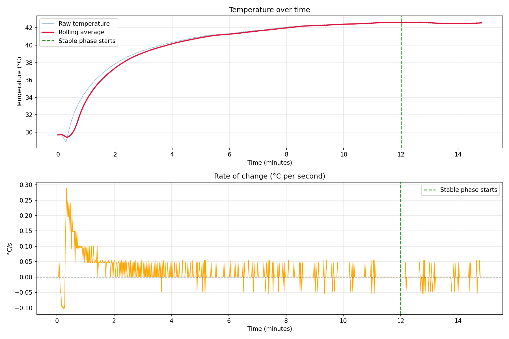
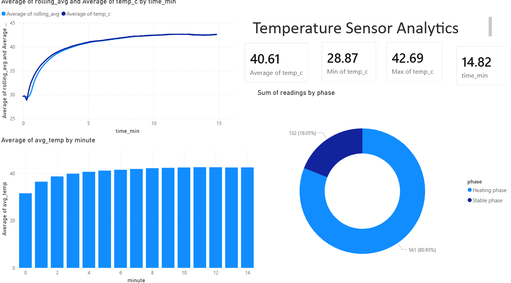

# 🌡️ Temperature Sensor Analytics Pipeline

An end-to-end data analytics project built with real industrial 
sensor data, developed as part of an internship application 
for Endress+Hauser.

## Project Overview
Analysis of 693 temperature readings captured over 14.82 minutes,
identifying heating phases, thermal equilibrium, and key statistics.

## Tech Stack
| Tool | Purpose |
|------|---------|
| Python (pandas, matplotlib) | Data cleaning, analysis, visualisation |
| SQLite + SQL | Database storage, 10 analytical queries |
| Power BI | Interactive dashboard |

## Key Findings
- Temperature rose from **28.87°C to 42.69°C** over ~14 minutes
- Stable phase (thermal equilibrium) reached at **~12 minutes**
- **80.95%** of readings captured during the active heating phase
- Average temperature across full experiment: **40.61°C**

## Project Structure
| File | Description |
|------|-------------|
| `analysis.py` | Phase 1 — Python data cleaning and analysis |
| `database.py` | Phase 2 — SQLite database setup and data import |
| `export_for_powerbi.py` | Phase 2 — Export prepared data for Power BI |
| `queries.sql` | Phase 2 — All 10 SQL analytical queries |
| `temperature_analysis.png` | Python matplotlib chart |
| `temperature_dashboard.pdf` | Final Power BI dashboard export |

## How to Run
1. Place `testdata.csv` in the project folder
2. Run `python analysis.py`
3. Run `python database.py`
4. Run `python export_for_powerbi.py`
5. Open `temperature_dashboard.pbix` in Power BI Desktop

## Python Analysis Chart

## Power BI Dashboard
